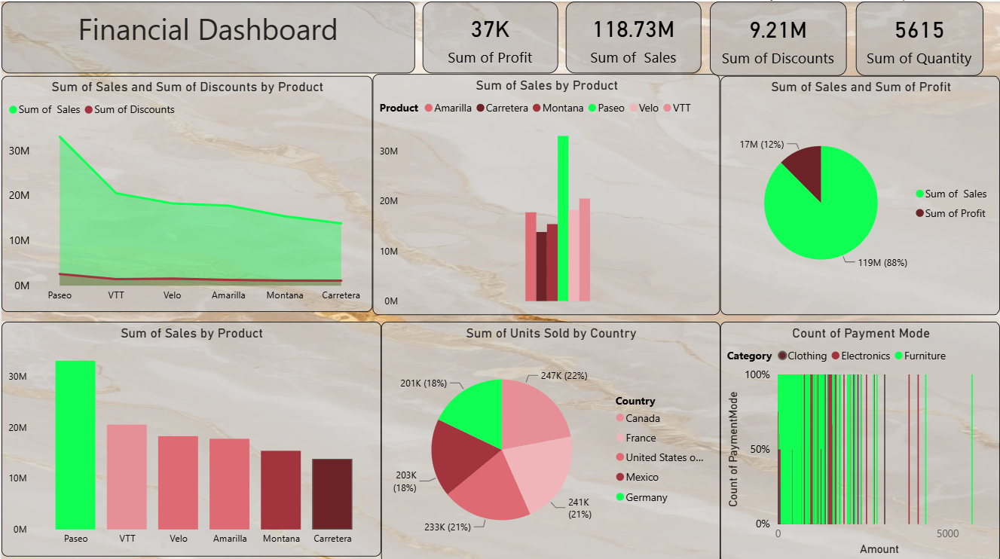

# Financial Dashboard (Power BI)

An interactive financial performance dashboard analyzing sales, discounts, and profit across products and countries built to identify top-performing products and understand where discounting is eating into margin.

---

##  Dashboard Preview

---

## Business Questions This Answers

- Which products drive the most sales, and how does that compare to profit?
- How much revenue is being given up to discounts?
- How are units sold distributed across countries?
- Which products carry disproportionately high discounts relative to their sales?

---

##  Key Insights

- **Total Sales: 118.73M | Total Discounts: 9.21M | Total Quantity Sold: 5,615 units**
- **Paseo is the clear top-performing product**, generating noticeably more sales than any other product line, roughly double the next closest performer
- **Sales are fairly evenly distributed across 5 countries** — Canada (22%), France (21%), United States (21%), Mexico (18%), and Germany (18%) — no single market dominates, suggesting a genuinely international customer base
- **Discounts remain relatively small relative to total sales** across most products, based on the "Sum of Sales and Sum of Discounts by Product" area chart, though Paseo's higher sales volume also comes with a proportionally visible discount line worth investigating further

---

## 📊 What's on the Dashboard

- **KPI Cards**: Total Profit, Total Sales, Total Discounts, Total Quantity
- **Area Chart**: Sales vs. Discounts by Product
- **Clustered Column Chart**: Sales by Product (by country/segment)
- **Pie Chart**: Sales vs. Profit split
- **Bar Chart**: Sales by Product, ranked
- **Pie Chart**: Units Sold by Country

---

##  Tools & Techniques

- **Power BI** — data modeling, DAX measures (Total Profit, Total Discounts), report design
- **Chart selection strategy**: paired an area chart (sales vs. discounts trend across products) with a ranked bar chart, so both the relative scale and the exact ranking of products are visible at a glance

---

##  Files

- `financial-dashboard.pbix` — the Power BI file
- `financial-dashboard-screenshot.png` — dashboard preview

---

##  How to View

1. Download `financial-dashboard.pbix`
2. Open in [Power BI Desktop](https://powerbi.microsoft.com/desktop/) (free)
3. Explore by Product and Country using the visual legends

---
